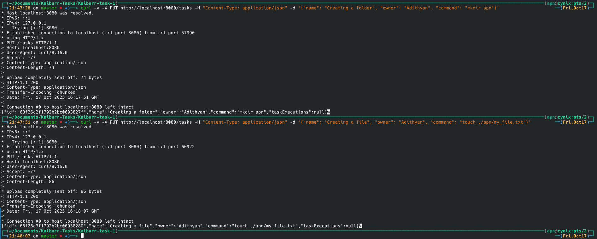
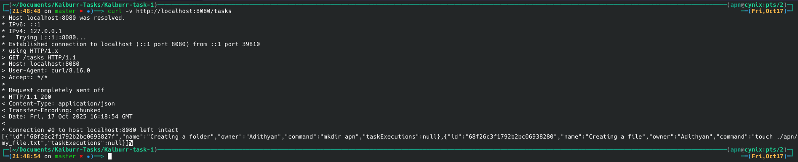
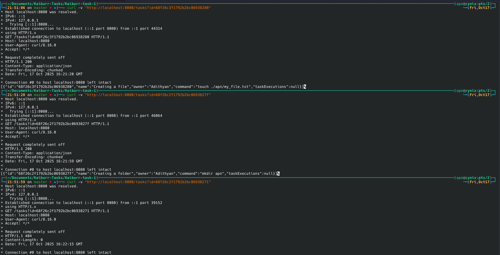
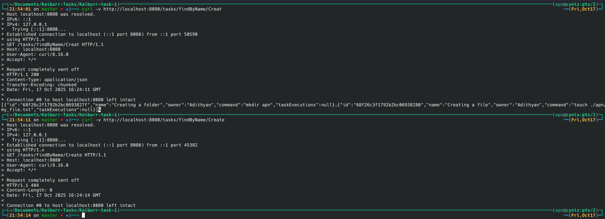
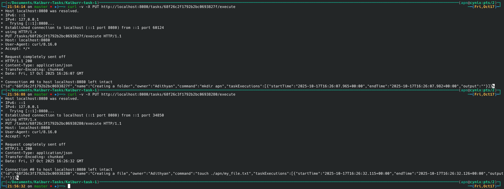
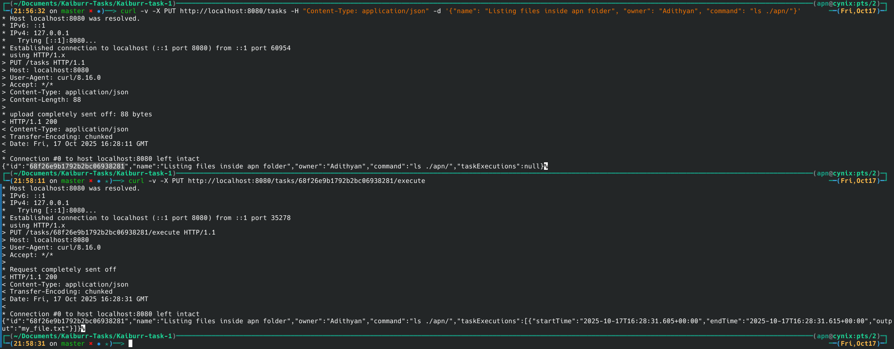
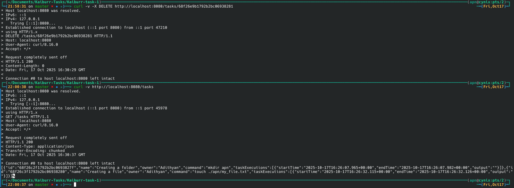

# Task 1: Java backend and REST API

This project is an application in JAVA which provides a REST API with endpoints for searching, creating, deleting and running "task" objects. Task objects represent shell commands that can be run in a kubernetes pod.

Each “task” object should contain the following properties:

* id (task ID, String)
* name (task name, String)
* owner (task owner, String)
* command (shell command to be run, String)
* taskExecutions (List < TaskExecuton >)

TaskExecution:

* startTime (execution start date/time, Date)
* endTime (execution end date/time, Date)
* output (command output, String)


## Prerequisites

Before you begin, make sure that you have these installed in your system:
- Java Development Kit
- Docker
- Maven

## How to Run Locally
1.  **Clone the repository:**
	```bash
	git clone https://github.com/a-p-n/Kaiburr-task-1.git
	cd Kaiburr-task-1
	```
2.  **Run the application:**
    - Ensure that you have docker and docker-compose installed.
    - Run:
    ```bash
    docker compose up --build -d
    ```
    - The application will start and it will be accessible at `http://localhost:8080`.

## API Endpoints

The following endpoints are available to interact with the application.

### 1. Create a Task

* **Method:** `PUT`
* **Endpoint:** `/tasks`
* **Description:** Creates a new task object. The command field is validated to prevent unsafe entries.
* **Command** : `curl -v -X PUT http://localhost:8080/tasks -H "Content-Type: application/json" -d '{"name": "Testing", "owner": "APN", "command": "ls"}'`
* **Request Body (JSON):**
    ```json
    {
        "name": "Testing",
        "owner": "apn",
        "command": "ls"
    }
    ```
* **Response:**
    ```json
    {
        "id": "68f1fefc43c1d03ccda9cc10",
        "name": "Testing",
        "owner": "APN",
        "command": "ls",
        "taskExecutions": null
    }
    ```

---

### 2. Get All Tasks

* **Method:** `GET`
* **Endpoint:** `/tasks`
* **Description:** Returns a list of all task objects in the database.
* **Command:** `curl -v http://localhost:8080/tasks`
* **Response:**
    ```json
    [
        {
            "id": "68f1fefc43c1d03ccda9cc10",
            "name": "Testing",
            "owner": "APN",
            "command": "ls",
            "taskExecutions": null
        }
    ]
    ```

---

### 3. Get Task by ID

* **Method:** `GET`
* **Endpoint:** `/tasks?id={taskId}`
* **Description:** Returns a single task object matching the provided ID. Returns `404 Not Found` if the ID does not exist.
* **Command:** `curl -v "http://localhost:8080/tasks?id=68f1fefc43c1d03ccda9cc10"`
* **Response:**
    ```json
    [
        {
            "id": "68f1fefc43c1d03ccda9cc10",
            "name": "Testing",
            "owner": "APN",
            "command": "ls",
            "taskExecutions": null
        }
    ]
    ```

---

### 4. Find Tasks by Name

* **Method:** `GET`
* **Endpoint:** `/tasks/findByName/{name}`
* **Description:** Searches for tasks where the name contains the provided string and returns a list of matching tasks.
* **Command:** `curl -v http://localhost:8080/tasks/findByName/Creat`
* **Response:**
    ```json
    [
        {
            "id":"68f26c2f1792b2bc0693827f",
            "name":"Creating a folder",
            "owner":"Adithyan",
            "command":"mkdir apn",
            "taskExecutions":null
        },
        {
            "id":"68f26c3f1792b2bc06938280",
            "name":"Creating a file",
            "owner":"Adithyan",
            "command":"touch ./apn/my_file.txt",
            "taskExecutions":null
        }
    ]
    ```

---

### 5. Execute a Task
* **Method:** `PUT`
* **Endpoint:** `/tasks/{taskid}/execute`
* **Description:** Executes the shell command associated with the specified ID on the server, capture its output and record the start time, end time and output in a new `taskExecutions` object.
* **Command:** `curl -v -X PUT http://localhost:8080/tasks/68f26e9b1792b2bc06938281/execute`
* **Response:**
    ```json
    {
        "id":"68f26e9b1792b2bc06938281",
        "name":"Listing files inside apn folder",
        "owner":"Adithyan",
        "command":"ls ./apn/",
        "taskExecutions":
        [
            {
                "startTime":"2025-10-17T16:28:31.605+00:00",
                "endTime":"2025-10-17T16:28:31.615+00:00",
                "output":"my_file.txt"
            }
        ]
    ```



---
### 6. Delete a Task

* **Method:** `DELETE`
* **Endpoint:** `/tasks/{taskId}`
* **Description:** Deletes the task object with the specified ID.
* **Command:** `curl -v -X DELETE http://localhost:8080/tasks/68f233b443c1d03ccda9cc11`
* **Response:** No content is returned.


