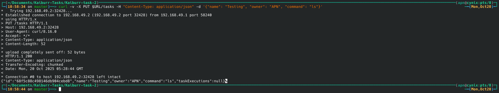
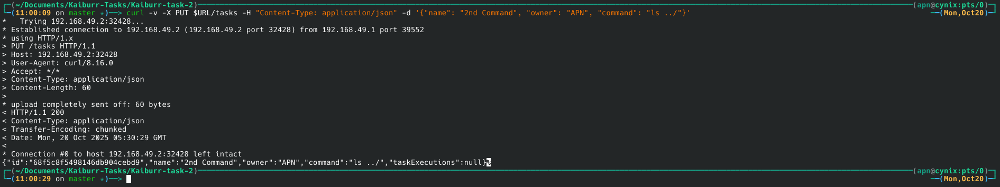
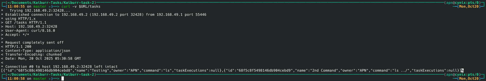
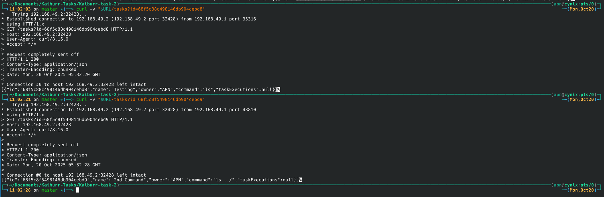

# Task 2: Java Backend on Kubernetes

This project is an application in JAVA which provides a REST API with endpoints for searching, creating, deleting and running "task" objects. Task objects represent shell commands that can be run in a kubernetes pod.

Each “task” object should contain the following properties:

* id (task ID, String)
* name (task name, String)
* owner (task owner, String)
* command (shell command to be run, String)
* taskExecutions (List < TaskExecuton >)

TaskExecution:

* startTime (execution start date/time, Date)
* endTime (execution end date/time, Date)
* output (command output, String)


Then containerizes it and deploys it to a local Kubernetes cluster (Minikube). It also deploys a MongoDB database in a separate pod with persistent storage.

**Key Feature:** The `/tasks/{id}/execute` endpoint is enhanced to programmatically create a new Kubernetes pod (using a `busybox` image) to run the task's shell command.

## Technology Stack

* **Java 17 / Spring Boot**
* **Docker**
* **Kubernetes (Minikube)**
* **Helm**
* **MongoDB**

---

## Prerequisites
* Java Development Kit
* Docker
* Maven
* Minikube
* Kubectl
* Helm

## How to Run Locally
1.  **Clone the repository:**
    ```bash
    git clone https://github.com/a-p-n/Kaiburr-task-2.git
    cd Kaiburr-task-2
    ```

2. **Start Minikube Cluster**
    ```bash
    minikube start
    ```

3. **Deploy MongoDB using Helm**
    * This installs MongoDB with persistence enabled.
    ```bash
    helm repo add bitnami https://charts.bitnami.com/bitnami
    helm install my-mongo bitnami/mongodb --wait
    ```

3. **Get MongoDB Root Password**
    * The Helm chart secures MongoDB with a random password stored in a Kubernetes secret. Retrieve it and create a kubernetes secret to store it:
    ```bash
    export MONGODB_ROOT_PASSWORD=$(kubectl get secret my-mongo-mongodb -o jsonpath="{.data.mongodb-root-password}" | base64 -d)
    kubectl create secret generic mongo-secret --from-literal=mongodb-root-password=$MONGODB_ROOT_PASSWORD
    ```

4. **Build Docker Image Inside Minikube**
    * The Kubernetes cluster needs access to your application's Docker image. Build it directly within Minikube's Docker environment:
    ```bash
    eval $(minikube docker-env -u)
    docker build -t apnpro/kaiburr-task-app:latest .
    minikube image load apnpro/kaiburr-task-app:latest
    ```

5. **Deploy Your Application to Kubernetes**
    * Apply all the configuration files (`rbac.yaml`, `deployment.yaml`, `service.yaml`):
    ```bash
    kubectl apply -f deployment.yaml
    kubectl apply -f service.yaml
    kubectl apply -f rbac.yaml
    ```

6. **Verify Deployment**
    * Check that your application pod and the MongoDB pod are running:
    ```bash
    kubectl get pods
    ```
    * Both should show `Running` status after a minute or two.

---

## How to Use the Deployed Application (Kubernetes)

1. **Get Access URL**
    * Minikube exposes services via NodePort. Get the accessible URL:
    ```bash
    URL=$(minikube service kaiburr-task-app-service --url)
    ```
    * Use the provided URL for all subsequent API calls.

2. **Test API Endpoints**
    * Use `curl` with the URL obtained above.

## API Endpoints
### 1. Create a Task

* **Method:** `PUT`
* **Endpoint:** `/tasks`
* **Description:** Creates a new task object. The command field is validated to prevent unsafe entries.
* **Command** : `curl -v -X PUT $URL/tasks -H "Content-Type: application/json" -d '{"name": "Testing", "owner": "APN", "command": "ls"}'`
* **Request Body (JSON):**
    ```json
    {
        "name": "Testing",
        "owner": "apn",
        "command": "ls"
    }
    ```
* **Response:**
    ```json
    {
        "id": "68f1fefc43c1d03ccda9cc10",
        "name": "Testing",
        "owner": "APN",
        "command": "ls",
        "taskExecutions": null
    }
    ```


---

### 2. Get All Tasks

* **Method:** `GET`
* **Endpoint:** `/tasks`
* **Description:** Returns a list of all task objects in the database.
* **Command:** `curl -v $URL/tasks`
* **Response:**
    ```json
    [
        {
            "id": "68f1fefc43c1d03ccda9cc10",
            "name": "Testing",
            "owner": "APN",
            "command": "ls",
            "taskExecutions": null
        }
    ]
    ```

---

### 3. Get Task by ID

* **Method:** `GET`
* **Endpoint:** `/tasks?id={taskId}`
* **Description:** Returns a single task object matching the provided ID. Returns `404 Not Found` if the ID does not exist.
* **Command:** `curl -v "$URL/tasks?id=68f1fefc43c1d03ccda9cc10"`
* **Response:**
    ```json
    [
        {
            "id": "68f1fefc43c1d03ccda9cc10",
            "name": "Testing",
            "owner": "APN",
            "command": "ls",
            "taskExecutions": null
        }
    ]
    ```

---

### 4. Find Tasks by Name

* **Method:** `GET`
* **Endpoint:** `/tasks/findByName/{name}`
* **Description:** Searches for tasks where the name contains the provided string and returns a list of matching tasks.
* **Command:** `curl -v $URL/tasks/findByName/Creat`
* **Response:**
    ```json
    [
        {
            "id":"68f26c2f1792b2bc0693827f",
            "name":"Creating a folder",
            "owner":"Adithyan",
            "command":"mkdir apn",
            "taskExecutions":null
        },
        {
            "id":"68f26c3f1792b2bc06938280",
            "name":"Creating a file",
            "owner":"Adithyan",
            "command":"touch ./apn/my_file.txt",
            "taskExecutions":null
        }
    ]
    ```

---

### 5. Execute a Task
* **Method:** `PUT`
* **Endpoint:** `/tasks/{taskid}/execute`
* **Description:** Executes the shell command associated with the specified ID on the server, capture its output and record the start time, end time and output in a new `taskExecutions` object.
* **Command:** 

    - Get the `id` of the task you created.
    - In a separate terminal, watch for pod creation: `kubectl get pods -w`
    - Send the execute request:
       ```bash
       TASK_ID="YOUR_TASK_ID_HERE"
       curl -v -X PUT $URL/tasks/$TASK_ID/execute
       ```
    d. Observe the `task-runner-...` pod appearing, running, and completing in the `kubectl get pods -w` terminal.
* **Response:**
    ```json
    {
        "id":"68f26e9b1792b2bc06938281",
        "name":"Listing files inside apn folder",
        "owner":"Adithyan",
        "command":"ls ./apn/",
        "taskExecutions":
        [
            {
                "startTime":"2025-10-17T16:28:31.605+00:00",
                "endTime":"2025-10-17T16:28:31.615+00:00",
                "output":"my_file.txt"
            }
        ]
    ```


---
### 6. Delete a Task

* **Method:** `DELETE`
* **Endpoint:** `/tasks/{taskId}`
* **Description:** Deletes the task object with the specified ID.
* **Command:** `curl -v -X DELETE $URL/tasks/68f233b443c1d03ccda9cc11`
* **Response:** No content is returned.


