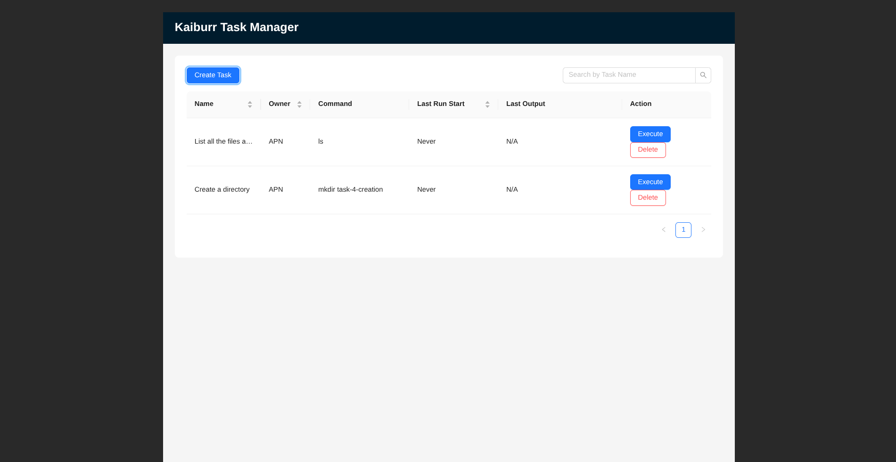
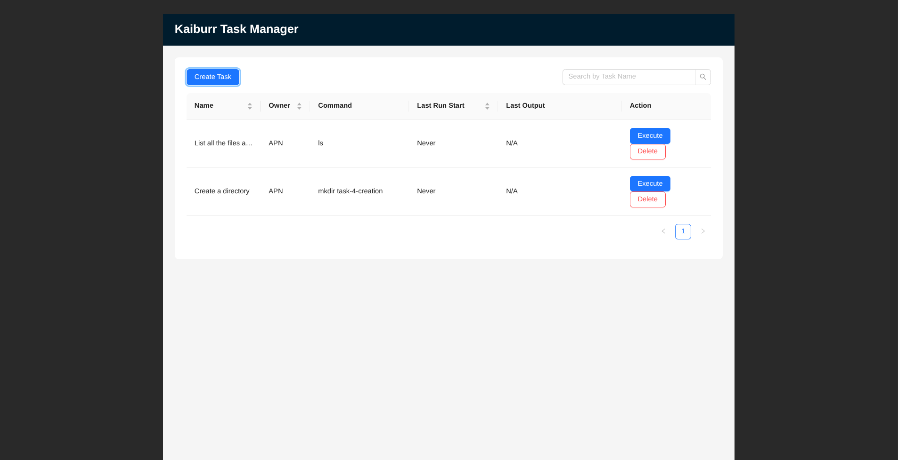
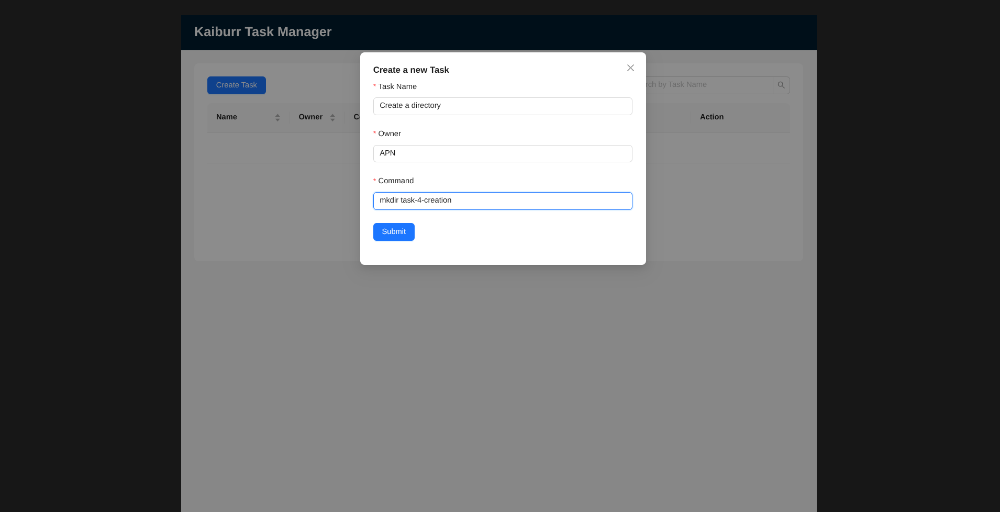
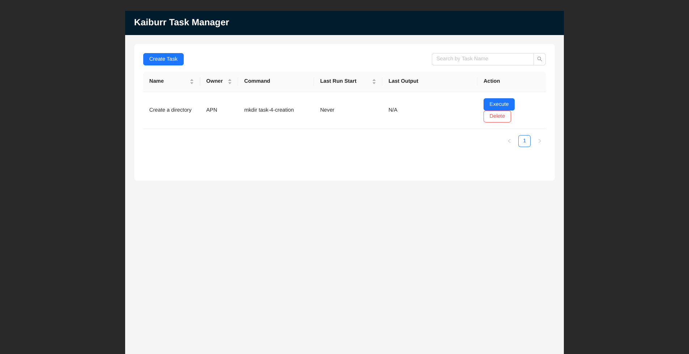
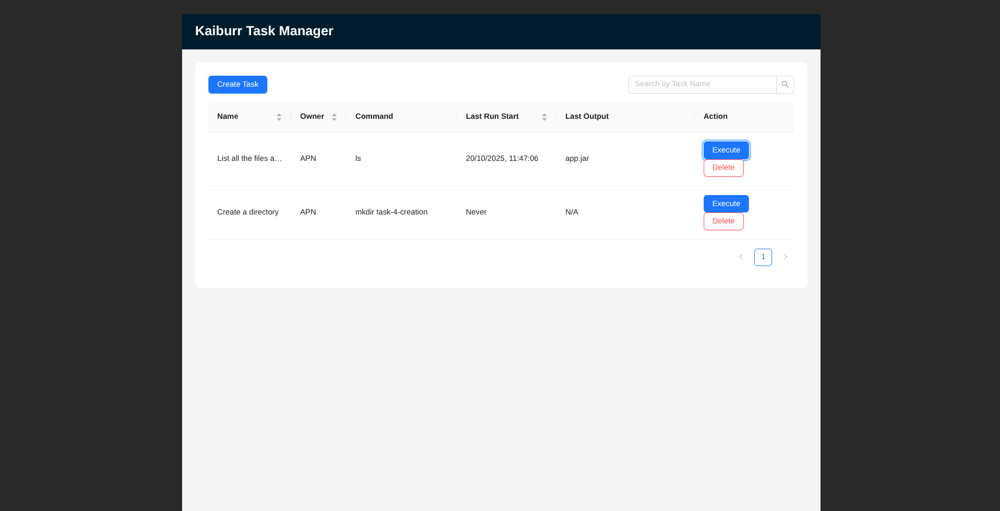
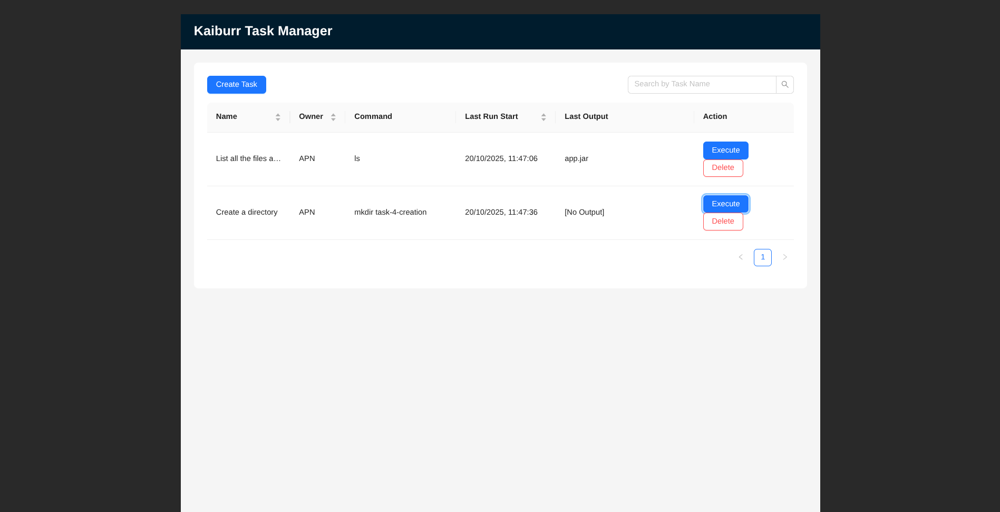
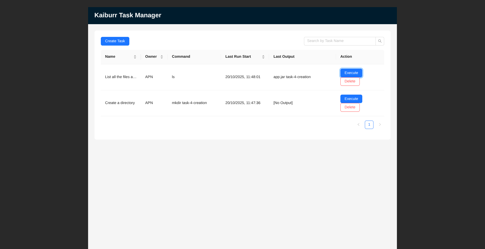
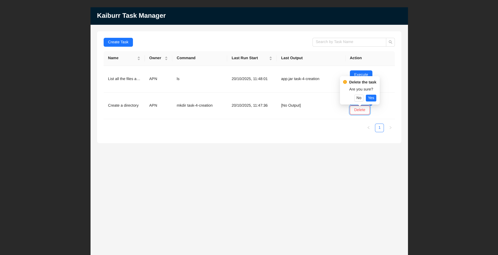
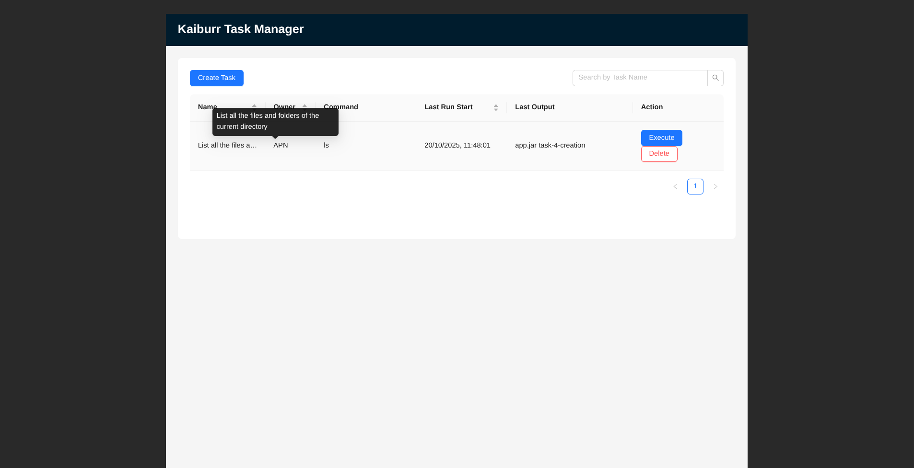

# Task 3: Web UI Forms

This project is an application in JAVA with a WEB UI which provides a REST API with endpoints for searching, creating, deleting and running "task" objects. Task objects represent shell commands that can be run in a kubernetes pod.

Each “task” object should contain the following properties:

* id (task ID, String)
* name (task name, String)
* owner (task owner, String)
* command (shell command to be run, String)
* taskExecutions (List < TaskExecuton >)

TaskExecution:

* startTime (execution start date/time, Date)
* endTime (execution end date/time, Date)
* output (command output, String)

## Project Structure
* `/backend`: Contains Java Spring Boot application
* `/frontend`: Contains the React/TypeScript/Vite application.

---
## Prerequisites

Before you begin, make sure that you have these installed in your system:
- Java Development Kit
- Docker
- Maven
- Node.js and npm

---
## How to Run Locally
1.  **Clone the repository:**
	```bash
	git clone https://github.com/a-p-n/Kaiburr-task-3.git
	cd Kaiburr-task-3
	```
2.  **Start the backend:**
    - Navigate to the backend directory.
    - Run:
    ```bash
    cd backend
    docker compose up --build -d
    ```
    - The backend will be accessible at `http://localhost:8080`.

3. **Start the frontend:**
    - Open a _new terminal_ and navigate to the frontend directory.
    - Run:
    ```bash
    cd frontend
    npm install
    npm run dev
    ```
---
## Application Functionality

### Task List View with Search




### Create Task



### Execute Task




### Delete Task


